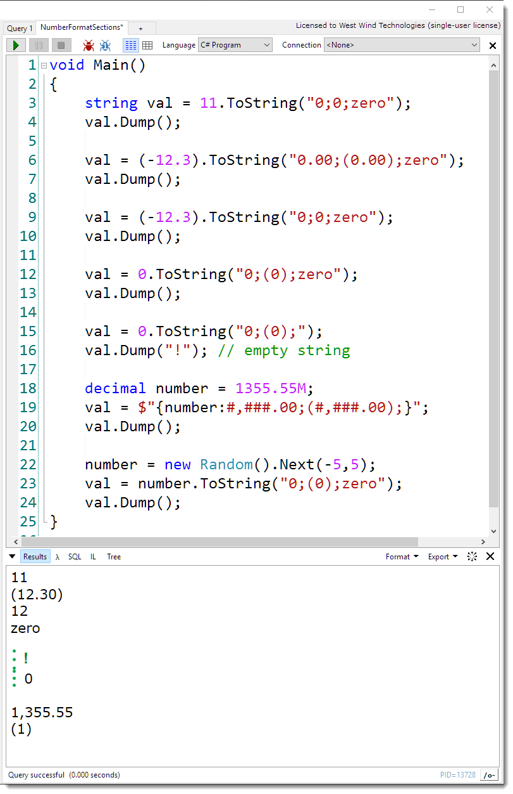

# C# NumberFormat Sections


I'm not sure how I've missed this feature in all those years of working in C#: `String.Format()` supports **Number Formatting Sections** that allow you to show separate values for positive, negative and zero values.

Take a look using [LinqPad](https://www.linqpad.net/):



You can find the official (and very limited) documentation on this feature on MSDN:

* [Custom Numeric Format Strings](https://msdn.microsoft.com/en-us/library/aa719871(v=VS.71).aspx)


### Number Format Sections
Sections are meant to separate:

* Positive Values
* Negative Values
* Zero Values

by using a single format string. The `;` character acts as a separator for those three values. But be aware that the format strings you use for the sections are very different than *normal* format strings - you can't use things like `n0` or `c2` but you have to be **explicit** about the number format. Instead you use `#` or `0` to specify number in the format string and `,` or `.` to specify thousands separator and decimal point respectively.

In other words, sections are a special kind of format string using its own custom format for each section.

So:

```
(12.3).ToString("0.00;(0.00);zero")  // 12.30
(-12.3).ToString("0.00;(0.00);zero")  // 12.302.3.ToString("0.00;(0.00);zero")  // (12.30)
0.ToString("0.00;(0.00);zero")  // 12.302.3.ToString("0.00;(0.00);zero")  // zero
```

produces the expected 2 decimal places of the number whereas using just `0` produces the integer values:

```
(12.30).ToString("0;(0);zero")  // 12
(-12).ToString("0;(0);zero")  // 12.302.3.ToString("0.00;(0.00);zero")  // (12)
0.ToString("0;(0);zero")  // 12.302.3.ToString("0.00;(0.00);zero")  // zero
```

You can use 0 or # for numbers to the left of the decimal point and `0` for numbers on the right of it. So this is the same as the last entries:

```
(12.30).ToString("#;(#);zero")  // 12
(-12).ToString("#;(#);zero")  // 12.302.3.ToString("0.00;(0.00);zero")  // (12)
0.ToString("#;(#);zero")  // 12.302.3.ToString("0.00;(0.00);zero")  // zero
```

You also need to be explicit about thousands separator, although you can use just `#,###.00` to specify that 1000s should be separated - even for larger numbers:

```
(112345.30).ToString("#,###.00;(0);zero")  // 112,345.30
(-112345.30).ToString("#,###.00;(0);zero")  // (112,345.30)
0.ToString("#,###.00;(0);zero")  // zero
```

Note that you can specify that the zero value is empty by not specifying it:

```csharp
val = 0.ToString("#;(#);");  // string.Empty
```

### String Interpolation
You can also use this functionality in C# 6.0's new **String Interpolation** template strings:

```cs
decimal number = 1355.55M;
val = $"{number:#,###.00;(#,###.00);}";
val.Dump();
```	
### Summary
So, this obviously isn't a game changer of a feature, but it's kinda cool in terms of being able to concisely format numbers especially in scenarios where the number formatting is inlined - like in templates are things like Razor where a function is a lot nicer to read than an immediate if expression.

I'm filing it under - obscure C# things I didn't know...

### Resources
* [MSDN Documentation](https://msdn.microsoft.com/en-us/library/aa719871(v=VS.71).aspx)
* [Format Strings 101](https://blogs.msdn.microsoft.com/kathykam/2006/03/29/net-format-string-101/)
* [Format Strings 102](https://blogs.msdn.microsoft.com/kathykam/2006/09/29/net-format-string-102-datetime-format-string/)

<!-- Post Configuration -->
<!--
```xml
<blogpost>
<abstract>
In all the years I've been using C#, I've completely missed that the NumberFormat features using .ToString() or string expressions support sections for positive, negative and zero values. In this post I describe the feature and how it works.
</abstract>
<categories>
C#
</categories>
<keywords>
NumberFormat, Section, Zero, Formatting
</keywords>
<isDraft>False</isDraft>
<weblogs>
<postid>55307</postid>
<weblog>
Rick Strahl's Weblog
</weblog>
</weblogs>
</blogpost>
```
-->
<!-- End Post Configuration -->
