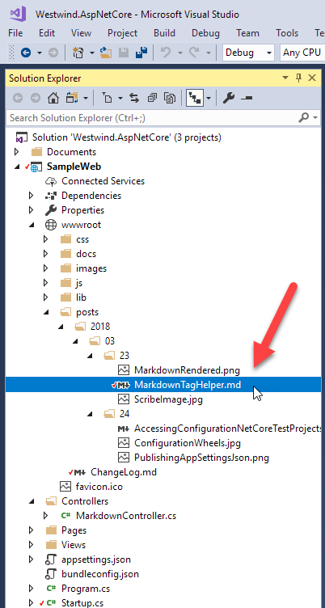
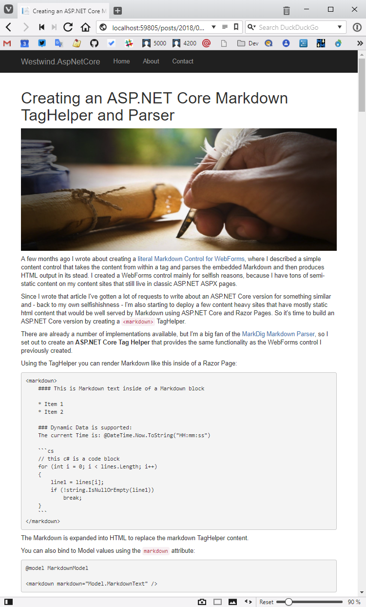
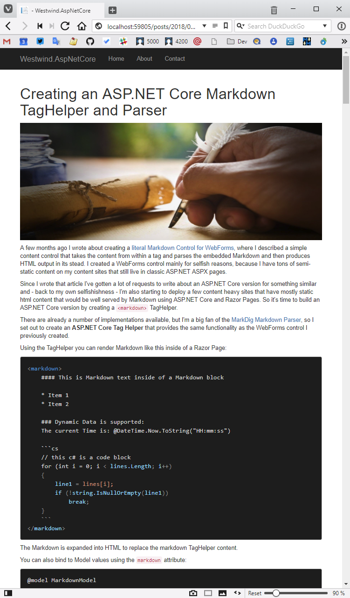
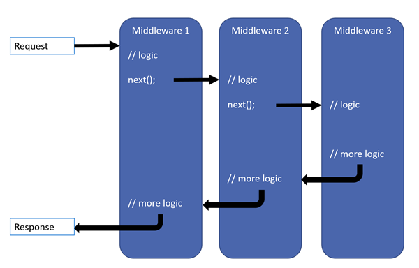

# Creating a generic Markdown Page Handler in ASP.NET Core


I'm in the process of re-organizing a ton of mostly static content on several of my Web sites and in order to make it easier to manage the boat load of ancient content I have sitting around in many places. Writing content - even partial page content - as Markdown is a heck of a lot more comfortable than writing HTML tag soup.

So to make this easier I've been thinking about using Markdown more generically in a number of usage scenarios lately, and I wrote last week's post on [Creating a Markdown TagHelper for AspNetCore](https://weblog.west-wind.com/posts/2018/Mar/23/Creating-an-ASPNET-Core-Markdown-TagHelper-and-Parser) and an earlier one on doing the [same thing with class ASP.NET WebForms pages](https://weblog.west-wind.com/posts/2017/Sep/13/A-Literal-Markdown-Control-for-ASPNET-WebForms). These controls allow for embedding Markdown content directly into ASP.NET Core MVC Views or Pages and WebForms HTML content respectively.

## Serving Markdown Files as HTML
But in a lot of scenarios even these controls add a lot of unnecessary cruft - it would be much nicer to simply dump some Markdown files and serve those files as content along with a proper content template so those pages fit into the context of the greater site. This typically means access to a layout page by way of a generic template into which the Markdown content is rendered.

By using plain Markdown files it's easier to edit the files, and when you host them in a repo like Github as they can just be displayed as rendered Markdown. In short it's a similar use case, but meant for content only displays that's ideal for Documentation sites or even things like a file only Blog.

So in this post I'll describe a generic Middleware implementation that allows you to drop Markdown files into a folder and get them served - either as `.md` extension files, or as extensionless Urls based on the filename without the extension.

### Generic Markdown Processing Middleware
The idea to process Markdown files directly is nothing new - it's a common feature in standalone documentation and CMS/Blog generators.

But wouldn't it be nice to have this functionality as a **simple, drop-in feature** that you can attach to **any folder** that is part of your existing Web application? In many of my dynamic Web sites, I often have a handful of information pages (like About, Terms of Service, Contact us, Support etc.) that are essentially static pages. And for those simple Markdown formatting is a perfect fit.

Additionally many sites also need documentation and having a separate area to actually document a site with simple Markdown files. You use only Markdown text, and leave the site chrome to a generic configured template that renders the reusable part of the site. When creating content all you do then is write Markdown - you can focus on content and forget the layout logistics.

##AD##

### What do we need to serve Markdown Pages?
Here are the requirements for serving 'static' markdown pages:

* A 'wrapper' page that provides the site chrome
* A content area into which the markdown gets dropped
* The actual rendered Markdown text from the file
* Optional Yaml Parsing for title and headers
* Optional title parsing based on a header or the file name

So, today I sat down to build the start of some generic middleware that processes Markdown content from disk and renders it directly using a configurable MVC View into which the Markdown content is rendered to provide the 'container' page that provides the styling and site chrome that you are likely to need in order to display your Markdown. This template can contain self contained HTML page content, or it can reference a `_Layout` page to provide the same site chrome that the rest of your site uses.

The idea is that I can set up one or more folders (or the entire site) for serving markdown files with an `.md` extension or extensionless Urls and then serve the Markdown files into a configurable View template.

The middleware is a relatively simple implementation that looks for a configured folder and extensionless urls within (think Docs for documentation or Posts folder for Blog posts)  or `.md` files in the configured folder. When it finds either, the URL is processed by loading the underlying Markdown file, rendering it to HTML and simply embedding it into the specified View template.


## Getting Started
If you want to try out the middleware I describe in this post, you can install the [NuGet package](https://www.nuget.org/packages/Westwind.AspNetCore.Markdown/) from here:

```txt
PM> Install-Package Westwind.AspNetCore.Markdown
```

or  take a look at the source code on Github:

* [Westwind.AspNetCore.Markdown on GitHub](https://github.com/RickStrahl/Westwind.AspNetCore/tree/master/Westwind.AspNetCore.Markdown)

### Setting up the Markdown MiddleWare
To use this feature you need to do the following:

* Use `AddMarkdown()` to **configure** the page processing
* Use `UseMarkdown()` to **hook up** the middleware
* Create a Markdown View Template (default is: `~/Views/__MarkdownPageTemplate.cshtml`)
* Create `.md` files for your content

### Basic Configuration 
The first step is to configure the Markdown processor by telling it which folders to look at. You specify a site relative folder, an optional MVC View or Page Template (the template has to exist) and a few optional parameters.

As usual for ASP.NET Core Middleware, you need to both hook up `ConfigureServices()` configuration and engage the Middleware in `Configure()`.

The following configures up a `/posts/` folder for processing for Markdown files:

```cs
public void ConfigureServices(IServiceCollection services)
{
    services.AddMarkdown(config =>
    {
        // Simplest: Use all default settings - usually all you need
        config.AddMarkdownProcessingFolder("/posts/", "~/Pages/__MarkdownPageTemplate.cshtml");
    });

    // We need MVC so we can use a customizable Razor template page
    services.AddMvc();
}
```

You then also need to hook up the Middleware in the `Configure()` method:

```csharp
public void Configure(IApplicationBuilder app, IHostingEnvironment env)
{
    app.UseMarkdown();

    app.UseStaticFiles();
    
    // we need MVC for the customizable Razor template
    app.UseMvc();
}
```

### Create a Razor Host Template
Next we need a Razor template that will host the rendered Markdown. This template is the "site chrome" that surrounds a rendered Markdown page. Each folder you configure can have its own template, so it's possible to vary the template. The template is just a Razor page that receives `MarkdownModel` which includes among other things a `Model.RenderedMarkdown` that you can embed into the page.

The simplest template you can create looks like this:

```html
@model Westwind.AspNetCore.Markdown.MarkdownModel
@{
    ViewBag.Title = Model.Title;
    Layout = "_Layout";
}
<div style="margin-top: 40px;">
    @Model.RenderedMarkdown
</div>
```

The template has really nothing in it except the rendered markdown. All the rest of the 'site chrome' will be picked up by the `_layout.cshtml` page which provides the over look and feel of the page.

Note that you can do whatever you want in the template. You don't have to use a `_layout` page - you can create a standalone page, or a page with partials and sections or whatever you want. All you have to make sure is there:

* Make sure you have a `@model Westwind.AspNetCore.Markdown.MarkdownModel`
* Make sure you call `@Model.RenderedMarkdown` to embed the rendered HTML
* Pick up the page title from `Model.Title`

Note that the title parsing is optional, but it is enabled by default. The middleware checks for YAML header and `title:` property or a `# Header` tag in the top 10 lines of content.

### Test it out
With this basic configuration code in place you should now be able to place a markdown file with a `.md` anywhere into the `/posts/` folder somewhere and render it. I took my last Weblog post's Markdown file and simply dumped it into a folder like this:



I can now go to:

```txt
http://localhost:59805/posts/2018/03/23/MarkdownTagHelper.md
```

or the extensionless version:

```txt
http://localhost:59805/posts/2018/03/23/MarkdownTagHelper
```

The default configuration works both with an `.md` extension or no extension. When no extension is specified the middleware looks at each extensionless request and tries to append `.md` and checks if a file exists then renders it.

With this in place you can now render the page like this:



Keep in mind this is pretty much a stock ASP.NET Core project - it uses the stock Bootstrap template and I haven't made any other changes to the layout or page templates, yet the markdown file **just works** as a drop in file.

Cool, n'est pas?

##AD##

## More Cowbell
Ok the above is the basics, lets look at a few more configuration and customization options here. You can:

* Customize the Razor template
* Configure folders that are handled
* Configure each folder's options

Let's take a look

### A better Template: Adding Syntax Coloring
Most likely you'll want to spruce up things a little bit. If you're doing software related stuff like documentation or a blog posts one of the first things you'll want is syntax highlighting. 

I'm a big fan of [highlightjs](https://highlightjs.org/) which comes with most common syntax languages I care about, and provides a number of really nice themes including `vs2015` (VS Code Dark), `visualstudio`, `monokai`, `twilight` and a couple of `github` flavors.

The code below explicitly uses the Visual Studio (Code) Dark theme (`vs2015`) that also use on Weblog site:

```html
@model Westwind.AspNetCore.Markdown.MarkdownModel
@{
    Layout = "_Layout";
}
@section Headers {
    <style>
        h3 {
            margin-top: 50px;
            padding-bottom: 10px;
            border-bottom: 1px solid #eee;
        }
        /* vs2015 theme specific*/
        pre {
            background: #1E1E1E;
            color: #eee;
            padding: 0.7em !important;
            overflow-x: auto;
            white-space: pre;
            word-break: normal;
            word-wrap: normal;
        }

            pre > code {
                white-space: pre;
            }
    </style>
}
<div style="margin-top: 40px;">
    @Model.RenderedMarkdown
</div>

@section Scripts {
    <script src="~/lib/highlightjs/highlight.pack.js"></script>
    <link href="~/lib/highlightjs/styles/vs2015.css" rel="stylesheet" />
    <script>
        setTimeout(function () {
            var pres = document.querySelectorAll("pre>code");
            for (var i = 0; i < pres.length; i++) {
                hljs.highlightBlock(pres[i]);
            }
        });

    </script>
}
```

> #### @icon-info-circle HighlightJs from CDN
> The provided highlight JS package includes a customized set of languages that I use most commonly and it also includes a custom language (FoxPro) that doesn't ship on the CDN. You can however also pick up HighlightJs directly off a CDN with:
> ```
> <script src="https://cdnjs.cloudflare.com/ajax/libs/highlight.js/9.12.0/highlight.min.js"></script>
> <link href="https://cdnjs.cloudflare.com/ajax/libs/highlight.js/9.12.0/styles/vs2015.min.css" rel="stylesheet" />
> ```    
 
Here's what the page looks like with the Syntax highlighting enabled:



Better right?

### Configuration Options
If you want more control over how the Markdown processing is done you can explicitly configure each of the folders you set up for Markdown handling. You can:

* Configure `.md` file and extensionless processing
* Specify whether you want to extract for title in the Markdown content
* Hook in pre-processing code that is passed to the host template
* Configure the Markdown Parser (Markdig)

The following sets up the `/posts` folder with some of the options explicitly set:

```cs
services.AddMarkdown(config =>
{
    // Simplest: Use all default settings - usually all you need
    config.AddMarkdownProcessingFolder("/docs/", "~/Pages/__MarkdownPageTemplate.cshtml");
    
    // Customized Configuration: Set FolderConfiguration options
    var folderConfig = config.AddMarkdownProcessingFolder("/posts/", "~/Pages/__MarkdownPageTemplate.cshtml");

    // Optional configuration settings
    folderConfig.ProcessExtensionlessUrls = true;  // default
    folderConfig.ProcessMdFiles = true; // default

    // Optional pre-processing
    folderConfig.PreProcess = (folder, controller) =>
    {
        // controller.ViewBag.Model = new MyCustomModel();
    };

    // optional custom MarkdigPipeline (using MarkDig; for extension methods)
    config.ConfigureMarkdigPipeline = builder =>
    {
        builder.UseEmphasisExtras(Markdig.Extensions.EmphasisExtras.EmphasisExtraOptions.Default)
            .UsePipeTables()
            .UseGridTables()                        
            .UseAutoIdentifiers(AutoIdentifierOptions.GitHub) // Headers get id="name" 
            .UseAutoLinks() // URLs are parsed into anchors
            .UseAbbreviations()
            .UseYamlFrontMatter()
            .UseEmojiAndSmiley(true)                        
            .UseListExtras()
            .UseFigures()
            .UseTaskLists()
            .UseCustomContainers()
            .UseGenericAttributes();
    };
}    
```
If you want to improve performance a little, don't use extensionless URLs for the markdown files. The way the implementation currently works extensionless URLs require intercepting every extensionless URL request and checking for a Markdown file with an `.md` extension. Using just .md files will only affect files that actually have an .md extension.

This can be mitigated with some caching behavior - I come back to that a bit later in this post.

The default Markdig configuration has most of the pipeline extensions enabled so most things just work, but if you want optimal performance for your Markdown processing explicitly whittling the list down to **just what you need** can yield better performance.

## Creating the Markdown File Middleware
So how does all of this work? As you might expect the process of creating this is actually not very difficult, but it does involve quite a few moving pieces as is fairly standard when you're creating a piece of middleware. 

Here's what is required

* Actual Middleware implementation to handle the request routing
* Middleware Extensions that hook into Start `ConfigureServices()` and `Configure()`
* MVC Controller that handles the actual render request
* The Razor template to render the actual rendered Markdown HTML


### A quick review of Middleware
The core bit is the actual Middleware extension that is hooked into the ASP.NET Core middleware pipeline.

Middleware is simply a class that implements a `Task InvokeAsycn(HttpContext context)` method. Alternately, Middleware can also be implemented directly in the `Startup` class or as part of a Middleware Extension using `app.Use()` or for terminating middleware using `app.Run()`

The idea behind Middleware is quite simple: You implement a middleware handler  that receives a context object and calls a `next(context)` which passes the context forward to the next middleware defined in the chain and it calls the next and so on until all of the middleware components have been called. Then chain reverses and each of the those calls return their task status back up the chain. 



<small>image credit: [Microsoft Docs](https://docs.microsoft.com/en-us/aspnet/core/fundamentals/middleware/?view=aspnetcore-2.1&tabs=aspnetcore2x)</small>

Middleware can handle both 'before' and 'after' operations - 'before' you pass on the call to `next()` for providing inbound functionality which is the most commonly used for the main middleware functionality. The 'after' processing fires after the call for `next()` completes which occurs after the chain has basically reversed. If you've used HttpModules in ASP.NET previously you can think of middleware as a module that can handle both pre-handler and post-handler operations in a single interface.

The 'after' handling can be used for cleanup or in post-processing final output (although that's actually pretty tricky given that the output stream like is complete already).

If any middleware component wants to terminate the pipeline after its inbound processing, it can simply **not call next()** and the chain reaction ends and reverses out. All the previously hooked up middleware still fires its post-next() code.

In this scheme the order of middleware components is very important since they fire in order declared. For example, it's crucial that things like the Authentication, Routing and CORS middleware bits are hooked up before the MVC middleware executes.

Implementing a dedicated middleware component usually involves creating the actual middleware component as well a couple of middleware extensions that allow for being called in `ConfigureServices()` for configuration (ie. `services.Add<MiddlewareName>()`), and `Configure()` for actually attaching the middleware to the pipeline (ie. `app.Use<MiddleWareName>()`. Yeah I know - talk about misnamed handlers: Configuration usually happens in `ConfigureServices()` where you configure the dependency injected components either directly or via callbacks that fire on each request and attaching the middleware is done in `Configure()` - no configuration usually happens in `Configure()` according to the patterns Microsoft has laid out. Go figure.

### Implementing Markdown Page Handling as Middleware
So lets look at the actual implementation of the Markdown Middleware.

The primary job of the middleware is to figure out whether an incoming request is a Markdown request by checking the URL. If the request is to an `.md` Markdown file, the middleware effectively rewrites the request URL and routes it to a custom, well-known Controller endpoint that is provided as part of this component library.

```csharp
public class MarkdownPageProcessorMiddleware
{
    private readonly RequestDelegate _next;
    private readonly MarkdownConfiguration _configuration;
    private readonly IHostingEnvironment _env;

    public MarkdownPageProcessorMiddleware(RequestDelegate next, 
                                           MarkdownConfiguration configuration,
                                           IHostingEnvironment env)
    {
        _next = next;
        _configuration = configuration;
        _env = env;
    }

    public Task InvokeAsync(HttpContext context)
    {
        var path = context.Request.Path.Value;
        if (path == null)
            return _next(context);

        bool hasExtension = !string.IsNullOrEmpty(Path.GetExtension(path));
        bool hasMdExtension = path.EndsWith(".md");
        bool isRoot = path == "/";
        bool processAsMarkdown = false;

        var basePath = _env.WebRootPath;
        var relativePath = path;
        relativePath = PathHelper.NormalizePath(relativePath).Substring(1);
        var pageFile = Path.Combine(basePath, relativePath);

        // process any Markdown file that has .md extension explicitly
        foreach (var folder in _configuration.MarkdownProcessingFolders)
        {
            if (!path.StartsWith(folder.RelativePath, StringComparison.InvariantCultureIgnoreCase))
                continue;

            if (isRoot && folder.RelativePath != "/")
                continue;

            if (context.Request.Path.Value.EndsWith(".md", StringComparison.InvariantCultureIgnoreCase))
            {
                processAsMarkdown = true;
            }
            else if (path.StartsWith(folder.RelativePath, StringComparison.InvariantCultureIgnoreCase) &&
                 (folder.ProcessExtensionlessUrls && !hasExtension ||
                  hasMdExtension && folder.ProcessMdFiles))
            {
                if (!hasExtension && Directory.Exists(pageFile))
                    continue;

                if (!hasExtension)
                    pageFile += ".md";

                if (!File.Exists(pageFile))
                    continue;

                processAsMarkdown = true;
            }

            if (processAsMarkdown)
            {             
                context.Items["MarkdownPath_PageFile"] = pageFile;
                context.Items["MarkdownPath_OriginalPath"] = path;
                context.Items["MarkdownPath_FolderConfiguration"] = folder;

                // rewrite path to our controller so we can use _layout page
                context.Request.Path = "/markdownprocessor/markdownpage";
                break;
            }
        }

        return _next(context);
    }
}
```

The key bit in this middleware uses `Context.Request.Path.Value` to grab the request path and based on that path determines whether the request needs to be passed on to the Markdown controller that renders the template. Most of the code above deals with checking the URL and if it is a match via `processAsMarkdown` path is simply rewritten to point at the MVC controller that renders the Markdown.

Middleware constructors can inject requested components via Dependency Injection and I capture the active Request delegate (`next`) in order to call the next middleware component. I also capture Markdown configuration that was setup during startup so that I can look at the path configuration and map it to the current path if any. The configuration holds a few global configuration settings as well as well as the configuration for each of the folders mapped in the configuration.

The code first tries to match the path to a configured path. If a matching path is found, it looks for a `.md` extension in the URL path. If it finds that it simply forwards the request to the controller by rewriting the URL to a fixed path that the controller is generically listening on.

Rewriting is simple - just set the Request.Path to a new value:

```cs
context.Request.Path = "/markdownprocessor/markdownpage";
```

If the URL is an extensionless URL things are a bit trickier. The code has to first check to see if the request is to a physical directory - if it is it's not a markdown file. It then has to append the `.md` extension and check for the file's existence the determine if the file can be found. If not the request is ignored and passed on in the middleware pipeline. If there is a matching markdown file on disk then it too gets re-written to the markdown controller's route path.

If the URL is to be processed the original, un-re-written URL and the actual filename are written into `Context.Items` along with the folder configuration that was matched which makes these values available in the Controller so we don't have to repeat the expensive lookup logic in the controller.

##AD##

### The Generic Markdown Controller
The request is forwarded to a controller that's implemented in the library. The controller has a single Action method that has a fixed and well-known attribute route: 

```cs
[Route("markdownprocessor/markdownpage")]
public async Task<IActionResult> MarkdownPage()
```        

This fixed route is found even though it lives in a library. Note that this route only works in combination with the middleware because it depends on preset `Context.Items` values that were stored by the middleware earlier in the request.

Here's main action method in the controller (full code on Github):

```cs
public class MarkdownPageProcessorController : Controller
{
    public MarkdownConfiguration MarkdownProcessorConfig { get; }
    private readonly IHostingEnvironment hostingEnvironment;

    public MarkdownPageProcessorController(IHostingEnvironment hostingEnvironment,
        MarkdownConfiguration config)
    {
        MarkdownProcessorConfig = config;
        this.hostingEnvironment = hostingEnvironment;
    }

    [Route("markdownprocessor/markdownpage")]
    public async Task<IActionResult> MarkdownPage()
    {            
        var basePath = hostingEnvironment.WebRootPath;
        var relativePath = HttpContext.Items["MarkdownPath_OriginalPath"] as string;
        if (relativePath == null)
            return NotFound();

        var folderConfig = HttpContext.Items["MarkdownPath_FolderConfiguration"] as MarkdownProcessingFolder;
        var pageFile = HttpContext.Items["MarkdownPath_PageFile"] as string;
        if (!System.IO.File.Exists(pageFile))
            return NotFound();
        
        // string markdown = await File.ReadAllTextAsync(pageFile);
        string markdown;
        using (var fs = new FileStream(pageFile, FileMode.Open, FileAccess.Read))
        using (StreamReader sr = new StreamReader(fs))
        {                
            markdown = await sr.ReadToEndAsync();                
        }
        
        if (string.IsNullOrEmpty(markdown))
            return NotFound();

        var model = ParseMarkdownToModel(markdown);
    
        if (folderConfig != null)
        {
            folderConfig.PreProcess?.Invoke(folderConfig, this);
            return View(folderConfig.ViewTemplate, model);
        }
        
        return View(MarkdownConfiguration.DefaultMarkdownViewTemplate, model);
    }

    private MarkdownModel ParseMarkdownToModel(string markdown, MarkdownProcessingFolder folderConfig = null)
    {
        var model = new MarkdownModel();

        if (folderConfig == null)
            folderConfig = new MarkdownProcessingFolder();

        if (folderConfig.ExtractTitle)
        {
            var firstLines = StringUtils.GetLines(markdown, 30);
            var firstLinesText = String.Join("\n", firstLines);

            // Assume YAML 
            if (markdown.StartsWith("---"))
            {
                var yaml = StringUtils.ExtractString(firstLinesText, "---", "---", returnDelimiters: true);
                if (yaml != null)
                    model.Title = StringUtils.ExtractString(yaml, "title: ", "\n");
            }

            if (model.Title == null)
            {
                foreach (var line in firstLines.Take(10))
                {
                    if (line.TrimStart().StartsWith("# "))
                    {
                        model.Title = line.TrimStart(new char[] {' ', '\t', '#'});
                        break;
                    }
                }
            }
        }

        model.RawMarkdown = markdown;
        model.RenderedMarkdown = Markdown.ParseHtmlString(markdown);

        return model;
    }
}
```

The main controller code reads the path from `Context.Items` and then checks to ensure the file exists. If it does reads the markdown from disk and passes it to a helper that populates the model.

The `ParseMarkdownToModel()` helper tries to extract a title and parses the markdown to HTML and stores those values on the model. The resulting model is then fed to the view specified in the folder configuration.

Et voilà! We have rendered Markdown documents.

### Markdown Parsing
The actual Markdown Parsing is handled by helper functionality in the library that includes the logic for configuring and implementing a specific Markdown parser. This library uses the popular [Markdig](https://github.com/lunet-io/markdig) parser by default.

I covered how the [Markdown Parsing is handled](https://weblog.west-wind.com/posts/2017/Sep/13/A-Literal-Markdown-Control-for-ASPNET-WebForms#parsing-markdown) in my last post and if you're interested how the Markdown pipeline is set up you can review it there.

### Performance
As I mentioned earlier this middleware has some overhead because it has to effectively look at every request for the folders you have configured and check either for the `.md` extension worse for extensionless URLs check whether the file exists. Therefore I recommend that you are very specific about the folders you set up to serve markdown from rather than making this a global hookup in the root folder. Use specific directories like `/docs/` or `/posts/` etc. rather than just setting the entire site to use the root `/` site.

There's some opportunity for optimization here as well. Output caching on the controller is one thing that would help, but I couldn't actually get this to work with server side caching - `ResponseCache` doesn't seem to work on the controller most likely due to the fact that the path is rewritten from the original URL. For caching to work it would have to be handled in code using a Memory (or other) Cache object directly and mapping to specific URL paths.

It would also help to cache file lookups to avoid the disk hit for file existence checks which are relatively slow. Keeping track of files that were previously checked could avoid that process. One advantage of the way things work now is that you don't have to worry about updating Markdown files on the server because currently there is no caching. Change the file and it will be picked up immediately in the next request.

## Summary
There's still stuff to do with this library, but I've thrown this into a few internal projects and so far it works great. These projects are applications that have lots of dynamic content, but also have several sections that are mostly static text which previously was hand coded HTML - I was able to throw out a bunch of these HTML pages and convert them to Markdown in [Markdown Monster](https://markdownmonster.west-wind.com) using the built-in converter. Since these were already in Markdown friendly simple semantic HTML they converted to Markdown quite nicely. The Markdown files greatly simplify editing and I've been able to pass of these documents to other non-coder types to edit where previously it was just easier for me or somebody else on my team to write the html ourselves.

This is nothing overly complex, but I find this drop in Markdown functionality incredibly useful and I'm sure I'll be using it extensively in the future. I hope some of you find this useful as well. If you end up using this library and you find issues or feature holes, please [file an issue on Github](https://github.com/RickStrahl/Westwind.AspNetCore/issues). Enjoy.

### Related Resources

* [Westwind.AspNetCore.Markdown on GitHub](https://github.com/RickStrahl/Westwind.AspNetCore/tree/master/Westwind.AspNetCore.Markdown)  (part of Westwind.AspNetCore)
* [Westwind.AspNetCore.Markdown NuGet Package](https://www.nuget.org/packages/Westwind.AspNetCore.Markdown)
* [Creating an ASP.NET Core Markdown TagHelper and Parser ](https://weblog.west-wind.com/posts/2018/Mar/23/Creating-an-ASPNET-Core-Markdown-TagHelper-and-Parser)
* [A Literal Markdown Control for ASP.NET WebForms](https://weblog.west-wind.com/posts/2017/Sep/13/A-Literal-Markdown-Control-for-ASPNET-WebForms)
* [How Middleware Works](https://docs.microsoft.com/en-us/aspnet/core/fundamentals/middleware/?view=aspnetcore-2.1&tabs=aspnetcore2x)

<div style="margin-top: 30px;font-size: 0.8em;
            border-top: 1px solid #eee;padding-top: 8px;">
    
    this post created and published with 
    <a href="https://markdownmonster.west-wind.com" 
       target="top">Markdown Monster</a> 
</div>