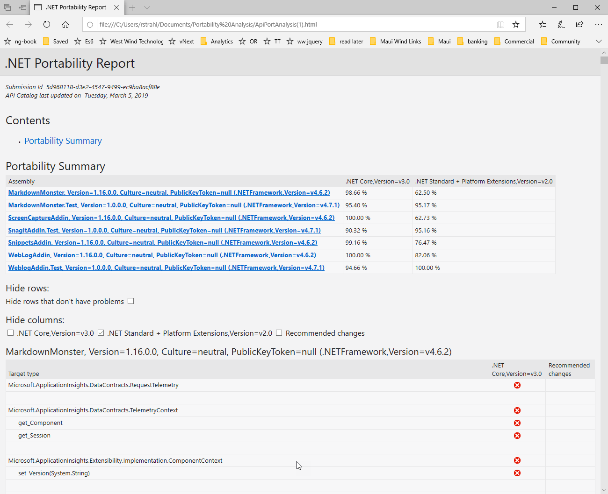
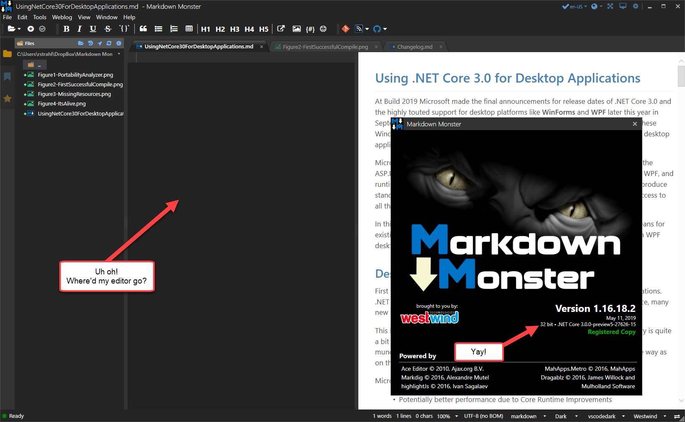
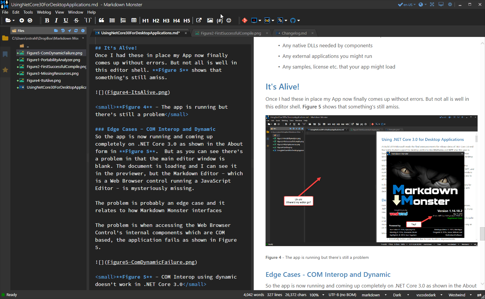
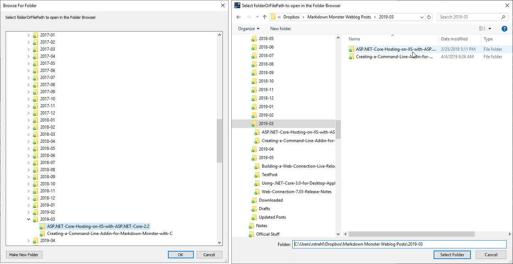
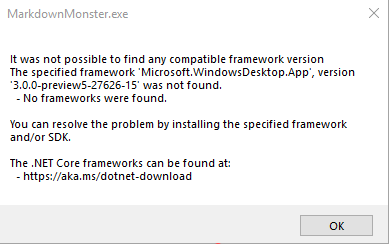
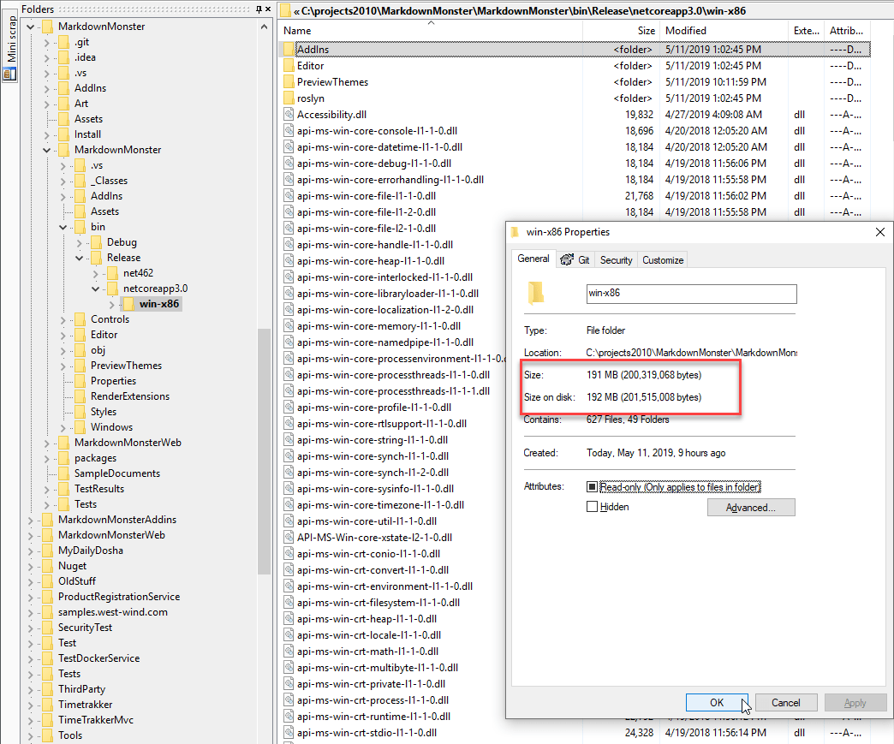

# Using .NET Core 3.0 for Desktop Applications

At Build 2019 Microsoft announced the release dates of .NET Core 3.0 and the highly touted support for desktop platforms like **WinForms** and **WPF** later this year in September. Today theres's still a large developer base building desktop applications using these .NET Windows desktop frameworks and by using .NET Core 3.0 you can now build desktop applications on the .NET Core platform.

Microsoft is accomplishing this task via a new Windows Desktop package (similar to the ASP.NET platform package), a desktop project type that knows about WinForms and WPF, and runtime NuGet packages that allow targeting desktop specific applications that can produce standalone .NET executables on .NET Core. The Windows support libraries provide access to all those Windows specific APIs that the .NET Core Runtime does not support. 

In this article I start by taking a look at what .NET Core support offers and what it means for existing desktop application, followed by a practical example of porting a production WPF desktop application to .NET Core to demonstrate what's involved in that process.

## Desktop Apps on .NET Core
First we need to discuss what .NET Core support means for Windows desktop applications. .NET Core conjures up all sorts of images: Cross-platform support, better performance, many new framework enhancements over the Full .NET Framework. 

This is all true for .NET Core server applications, but for desktop applications the story is quite a bit different. Running a Windows desktop applications on .NET Core is much more mundane: The primary goal appears to be compatibility to run applications the same way as on the desktop framework but leveraging the .NET Core framework.

Microsoft is making a few promises for using .NET Core for your Desktop apps:

* Potentially better performance due to Core Runtime Improvements
* Control over what Runtime to use
* Support for new .NET Core and Language Features 
* Open Source improvements to WPF and WinForms for .NET Core

I'll dig into these below, but let's start with a few misconceptions that keep popping up.

### No - you can't run your Windows Desktop App on a Mac or Linux!
Let's with the most important point, because I've seen quite a few reach the wrong conclusions because of the .NET Core assumption:

> Moving to .NET Core will not make your Windows Desktop apps run on a Mac or Linux.

While .NET Core Runtime is cross platform and can run on Mac and Linux, when using desktop frameworks with .NET Core your app still relies on the underlying Windows platform. WinForms uses the the Win32 API uses **Hwnd** style rendering while WPF uses DirectX and neither of these would work on other platforms. The .NET Core Runtime itself **doesn't support any platform specific features on Windows, Mac or Linux**, but rather provides Windows runtime and support NuGet packages that are referenced by desktop projects. These packages provide access to all those Windows specific APIs like the WinForms and WPF frameworks, as well PInvoke, COM, Registry access and so forth. Effectively you are running .NET Core with a bunch of platform specific libraries.

In other words all the 'desktop features' are not part of the .NET Core runtime, but instead live in these separate support packages that are added to your project.

### No Major Feature Changes
Once you convert a desktop application to run under .NET Framework you're not going to see much in the way of new features or other changes. Above all the goal of these support packages in this first release is **compatibility** so that you can run all of your existing code on top of .NET Core. And for the most part that promise totally holds true. While there are a few edge cases that might require workarounds, for the most part it's possible to run a full framework application on .NET Core with next to no changes.

But the desktop frameworks themselves haven't changed. There are a few small changes that have been made in the Core versions. For example, the Windows Forms `FolderBrowserDialog` now uses the new style, Explorer like file browsing dialog that's much more user friendly than the old one. But there are very few changes at this point. This might change in the future, but for the 3.0 release the focus is clearly on making sure existing code runs on .NET Core rather than new features or enhancements.

### No Big Performance Improvements - Yet
.NET Core also isn't going to buy you much in terms of performance. As far as I can tell so far there will be no amazing performance gains. In my application I ported some brief profiling showed that the .NET Core version was slightly slower to start up (in Preview 5) and in overall application performance the application didn't feel noticable faster or slower for any operations. Performance for the few areas I profiled other than startup look pretty close to the same as in full framework. That's to be expected, because while .NET Core has some pretty cool new tech in it for improved performance, most Windows specific code doesn't take advantage of these new features yet.

### Performance Potential
Microsoft mentions performance as a big reason to go to .NET Framework and while that may not yet be the case I think that there a number of options on the horizon that make this more interesting. 

**Tiered Compilation** In addition, .NET Core has many performance improvements that have greatly benefited the Web stack, but it required specific optimization to use these improvements. Things like `Span<T>`, `Memory<T>` and `ArraySegment<T>` are low level, system enhancements that can yield impressive memory and performance improvements. These new  features are slowly finding their way into the Core CLR where they bring improvements to all applications. Specific frameworks can also benefit as ASP.NET Core has, but it requires some investment into those frameworks to take advantage of these features. Whether Microsoft or the open source community maintaining WinForms and WPF will do any of that is anyone's guess.

In addition .NET Core has many performance improvements that have greatly benefited the Web stack, but it required specific optimization to use these improvements. Things like Spans

It looks like those benefits but that can change as some of the optimizations can also be applied to the desktop stack. Whether that happens is anybody's guess - Microsoft doesn't appear to make any commitments but the possibility is definitely there and with the desktop frameworks being open source now, we can perhaps expect more interest from non-Microsoft folks in taking a look at some of the bottlenecks.

### Support for new CLR and Language Features
With full framework being put out to pasture for new feature development, all new features in the .NET Stack are only going to happen in .NET Core. At Build Microsoft also announced .NET 5.0 which is meant to be a convergence of the various .NET's that Microsoft now owns: .NET Core, Full Framework and Mono in particular. In this ambitious announcement Microsoft is trying to bring the best of each of these frameworks under a single hat.

If you want to continue to use new features in the CLR and C#, you really no longer have a choice but to jump on the .NET Core band wagon, since full framework won't see any new features. Already C# 8 is diverging enough that some of the requirements for the language are not supported on full framework. .NET Standard 2.1 also will not support .NET Framework.  If you want to use these features .NET Core is your only choice.

### Control over the Runtime
One big complaint with full framework desktop applications has been that applications are tied to the full .NET Framework. Since Version 4.0 .NET Framework has been an unusual in-place update, which basically replaces the same framework for each update. While this is nice for continuity it also can cause compatibility problems as multiple applications on the same machine might require features from different versions that might have ever so slightly changed or broken functionality.

.NET Core addresses the problem by providing either side by side shared frameworks, or a fully self-contained install that contains all the runtime files directly with your application. This makes it possible to ensure that you have **exactly** the right version of the framework that matches is required to run your application, regardless what other applications are using and requiring. As long as a compatible shared runtime or a dedicated install is available the application can use that exact configuration.

### Use the New Project Style for Desktop Apps
Along with the desktop specific runtimes there's also a new SDK style desktop project that you can use. This project style is much simpler and it has some basic understanding of features of both WinForms and WPF. The project file automatically pulls in all files, automatically compiles Xaml documents in WPF, automatically picks up resource depedencies in WebForms and so on. The end result is that you end up with a project file that is very simple to understand and reason about. Rather than adding every file to the project you want to compile, you only explicitly add files you want to exclude or have to perform special operations like **Copy to Output Directory** on content files.

To be fair this feature is not tied to .NET Core 3.0 - you can also use this new project type with full framework projects. In fact as you'll see later in this article you can even multi-target both for .NET Framework **and** .NET Core from the same project.

### It's an Investment in the Future of .NET
So above all moving to .NET Core with existing desktop applications isn't about new features, improved performance or any other tangiable runtime improvements. Rather it is about making an investment in moving to an **evolving platform**. 

At Build 2019 Microsoft also announced that there will not be any new feature development for Full .NET Framework. .NET 4.8 is the last release of .NET Framework and it will be updated only for security patches and bug fixes. There will be no additional features added. This means full framework libraries like ASP.NET Web Forms, Web Pages, WCF, WorkFlow and also WPF, WinForms (on full framework only) also won't see any new improvements. WPF and WinForms however can live on in .NET Core which is part of the the reason for this article.

> 4.8 is the last .NET Desktop version of .NET according to Microsoft.

Going forward .NET Core is where are all new feature improvements are made.

This means that all improvements to .NET and the .NET Languages are only going to happen in .NET Core not in Full Framework. If you want to continue to see any of those improvements in your desktop development, then .NET Core will be the only way forward. 

## Porting an existing application
Ok enough abstract banter - let's look at some nuts and bolts of moving a WPF application to .NET Core. I'll use one of desktop applications [Markdown Monster](https://markdownmonster.west-wind.com) as an example here. Markdown Monster is a full featured Markdown editor and Weblog Publisher that provides an extensible editor. It has support for addins - something that is important in this upgrade context. It's what I would call a medium sized application that's mostly self-contained with the aforementioned addin model to provide additional extensibility and features. It also has a few edge case scenarios it deals with - specifically COM interop with the Web Browser control - which as it turns out was actually the biggest migration issue I had to deal with, and I'll talk about that as we go through this process.

### The Portability Analyzer
The first thing you should do before you get started is use the [.NET Portability Analyzer](https://docs.microsoft.com/en-us/dotnet/standard/analyzers/portability-analyzer) on your project to determine how compatible your application is. It's a [Visual Studio extension](https://marketplace.visualstudio.com/items?itemName=ConnieYau.NETPortabilityAnalyzer) that you run against your project and you specify your output targets that you want to check for. Once installed you can use **Analyze - Analyze Assembly Portability** to point at your main assembly and let it loose.

It's pretty good at finding things that are not supported by a target platform both in your target assembly as well as its dependencies, and it produces a report that gives good pointers on areas that you need to fix. When I initially ran Markdown Monster against it, the analyzer found it to be 98% compatible and all the areas where there problems tended to be in library dependencies that the code path never actually touched. 



<small>**Figure 1** - Running the Portability Analyzer to find porting issues before you start </small>

### Creating a new Project
The next step is to create a new SDK style project for your existing application. This will likely be the most tedious step in the migration process as you have to create a new project from scratch, then add all of your dependencies, content file settings and special project behaviors back into this empty project. 

Let's do it step by step. The first step is to create a new project and the first thing I did is create a new minimal project file:

```xml
<Project Sdk="Microsoft.NET.Sdk.WindowsDesktop">
 
  <PropertyGroup>
    <OutputType>WinExe</OutputType>
    <TargetFramework>netcoreapp3.0</TargetFramework>
    <Version>1.16.2</Version>
    <AssemblyName>MarkdownMonster</AssemblyName>
    <UseWPF>true</UseWPF>
  </PropertyGroup>

</Project>
```

Notice the various special project type entries the Sdk value, **OutputType** and **UseWPF** are all specific to in this case a WPF project. For WinForms change `<UseWPF>` to `<UseWinForms>`.

At this point I can actually open my project in my Visual Studio as a new SDK style project.

Note that in the Markdown Monster example I have **one main EXE project** and a number of support Addin projects which depend on the master project. This is backwards from most projects which have a main project with support projects that are loaded by the main project. In that case you probably want to start upgrading the required support projects fist. If your support projects don't include desktop functionality you should target **.NET Standard 2.0 or 2.1** or **.NET Core App** and use a standard library project which  as a desktop target as you won't need all the Windows desktop dependencies and you might want to reuse the project for non-Desktop  applications.

For example for .NET Standard:

```xml
<Project Sdk="Microsoft.NET.Sdk">
  <PropertyGroup>
    <TargetFramework>netstandard2.0</TargetFramework>
    <Version>3.0.26</Version>
</Project>    
```
### Fix Assembly Attributes
To upgrade the main project I first need to delete my existing **Properties.cs** file that holds assembly directives **or** add a `<GenerateAssemblyInfo>false</GenerateAssemblyInfo>` into the `<PropertyGroup>`. Assembly attributes are now maintained in the project file itself using standard NuGet schema values and if you don't delete or use the attribute they are duplicated which causes a compilation error.

### Add NuGet Packages
The next step is to add all the NuGet packages that were in **packages.config** into the project itself:

```xml
<ItemGroup>
  <PackageReference Include="Dragablz" Version="0.0.3.203" />
  <PackageReference Include="FontAwesome.WPF" Version="4.7.0.9" />
  <PackageReference Include="HtmlAgilityPack" Version="1.11.3" />
  <PackageReference Include="LibGit2Sharp" Version="0.26.0" />
  <PackageReference Include="LumenWorksCsvReader" Version="4.0.0" />
  <PackageReference Include="MahApps.Metro" Version="1.6.5" />
  <PackageReference Include="Markdig" Version="0.16.0" />
  <PackageReference Include="Microsoft.ApplicationInsights" Version="2.9.1" />
  <PackageReference Include="Microsoft.Windows.Compatibility" Version="2.0.1" />
  <PackageReference Include="NHunspell" Version="1.2.5554.16953" />
  <PackageReference Include="Westwind.Utilities" Version="3.0.25" />
</ItemGroup>
```

You only have to specify top level NuGet packages. There's no need to add dependencies as they will be pulled automatically which cuts down on the number of packages compared to what's in **package.config**.

Note also that not all of the packages in that list are .NET Standard compliant yet they still work. For example, I'm using the current version of MahApps and Dragablz, which are targeted for .NET 4.6 and they work just fine. The compiler throws a warning on those that they can't be targeted for .NET Core 3.0 but they still compile and also work at runtime.

> You can reference .NET Framework compiled assemblies that are not .NET Standard or Core compliant in any way in .NET Core 3.0. The Portability Analyzer and the compiler will let you know if there's compile time problem with using a specific library, but if there are problems you will likely find them at runtime. So far with Markdown Monster all my 4.x assemblies work without a problem in .NET Core 3.0.


At this point I was able to get my project to compile. I had to fix a few small errors where there were library references in my own libraries that aren't available for .NET Core, but those were problems of my own doing that you are unlikely to run into. Still there might be a handful of things you will have to fix before your project will build.
  
At this point I have a building project.

### More Windows Cowbell
If your project doesn't build and you get errors that pertain to .NET Framework runtime libraries that appear to be missing you might have to add a reference to the following NuGet package:

```xml
<PackageReference
    Include="Microsoft.Windows.Compatibility" 
    Version="2.0.1" />
```

The base Windows runtimes included in the Desktop runtimes provide most of the desktop framework related APIs plus all of their dependencies, which are all Windows specific. These libraries pull in a lot of the Windows specific .NET BCL/FCL functionality, but not all of it.

If you have some specific APIs that are not found, you can add this package which adds many more system level Windows APIs. Things ODBC support, special COM interface operations,  Enterprise Services etc.

### Adding References
If you still have problems with compilation you can also add explicit assembly references.

Still have problems with some APIs even after adding the references? You can also explicitly add libraries from the .NET Install folder and reference assemblies from there directly. You will have to **Copy Local** to force the assemblies to be copied to your output folder in 3.0. This may or may not work based on whether all the required dependencies are available. You'll have to experiment to see what works and what doesn't. 

I ran into one API - the WPF Speech API that I could not get to work. I was able to get to compile by copying it local into my output folder, but then the Speech API calls failed with an internal error, presumably because some dependency is missing. Hopefully these APIs are far and few between, but if it doesn't work in that case you are out of luck. However, I think the vast majority of common Windows APIs are supported.

### Adding your Entry Point
The last thing I had to do to get my project to finally compile was to change my entry point. Markdown Monster doesn't start with App.xaml, but uses a Startup class that explicitly intercepts the application event loop to provide some additional error trapping. 

If you are using an entry point other than `app.xaml` as I am you'll have to add that explicitly. You can add it to the in the main project group like this:

```xml
<StartupObject>StartUp</StartupObject>
```

Alternately use Visual Studio's project dialog to pick the Startup class.

### Run it!
So at this point I got my project to compile successfully.I'm still getting a bunch of warnings that pertain to assemblies that aren't .NET Standard or .NET Core compliant as you can in **Figure 2**.


<small>**Figure 2** - First project compilation. Warnings for full framework packages but they compile and run!</small>

I'm ready to run the project I fire it up and... we still have a problem Houston! A runtime error that complains project resources as shown in **Figure 3**.


<small>**Figure 3** - Make sure you add your WPF resources like images to the project explicitly</small>

This error complains about missing image resources which are not pulled into the project by default. Recall that SDK style projects know about common file types like XAML files, .cs files to compile etc., but it can't automatically assume all images to be embedded resources. So resources have to be added explicitly, just as in old style projects.

To do this I need to add the **compiled resources** explicitly to the project:

```xml
<ItemGroup>
  <Resource Include="Assets/MarkdownMonster.png" />
  <Resource Include="Assets/MarkdownMonster_Icon_256.png" />
  <Resource Include="Assets/vsizegrip.png" />
  <Resource Include="Assets/folder.png" />
  <Resource Include="Assets/git.png" />
<ItemGroup>
```

I recompile and re-run now and I get past that error but I get a different error that fails to find disk resources that should be distributed to the output folder. Markdown Monster ships a bunch of HTML resources for the editor and previews, so those need to be provided as loose files in the output folder.

Additionally it also ships a couple of support EXE applications for image compression and generating PDF files as well as a sample document - these files too have to be explicitly added to the project now:

```xml
<ItemGroup>
    <None Update="Editor\**\*.*">
      <CopyToOutputDirectory>PreserveNewest</CopyToOutputDirectory>
    </None>
    <None Update="PreviewThemes\**\*.*">
      <CopyToOutputDirectory>PreserveNewest</CopyToOutputDirectory>
    </None>
    <None Update="Hunspellx86.dll">
      <CopyToOutputDirectory>PreserveNewest</CopyToOutputDirectory>
    </None>
    <None Update="pingo.exe">
      <CopyToOutputDirectory>PreserveNewest</CopyToOutputDirectory>
    </None>
    <None Update="wkhtmltopdf.exe">
      <CopyToOutputDirectory>PreserveNewest</CopyToOutputDirectory>
    </None>
    <None Update="SampleMarkdown.md">
      <CopyToOutputDirectory>PreserveNewest</CopyToOutputDirectory>
    </None>
  </ItemGroup>
```

It's easy to forget files in this list. I know I did and ended up adding files later after I found things not working. Things to remember:

* Any Content files that need to be in the output folder
* Any native DLLs needed by components
* Any external applications you might run
* Any samples, license etc. that your app might load


### It's Alive!
Once I had these in place my App now finally comes up without errors. But not all is well in this editor shell. **Figure 5** shows that something's still amiss.



<small>**Figure 4** - The app is running but there's still a problem</small>

### Edge Cases - COM Interop and Dynamic
So the app is now running and coming up completely on .NET Core 3.0 as shown in the About form in **Figure 5**.  But as you can see there's a problem in that the main editor window is blank. The document is loading and I can see it in the previewer, but the Markdown Editor - which is a Web Browser control running a JavaScript Editor - is mysteriously missing.

The problem is probably an edge case and it relates to how Markdown Monster interfaces

The problem is when accessing the Web Browser Control's internal components which are COM based, the application fails as shown in Figure 5. 


<small>**Figure 5** - COM Interop using dynamic doesn't work in .NET Core 3.0</small>

It's not actually COM Interop that's failing but more specifically **accessing a COM object using the `dynamic` keyword. As it turns out in Markdown Monster there's quite a lot of that going on as it interacts extensively with the editor JavaScript object running inside of the Web Browser control, which is entirely driven through COM interop. Ouch!

However, I was able to get the editor to come up and work at least with minimal functionality by replacing a few of the COM interop interactions with traditional Reflection calls instead of using dynamic.

I ended up reverting the code to use various Reflection helpers.

```cs
object window = ReflectionUtils.GetPropertyCom(doc, "parentWindow");

AceEditor = ReflectionUtils.InvokeMethod(window,"InitializeInterop",this);

if (AceEditor != null)
{
    // Doesn't work in Core 3.0
    //AceEditor.setvalue(markdown ?? string.Empty, position, keepUndoBuffer);

    ReflectionUtils.CallMethodCom(AceEditor, "setvalue", markdown ?? string.Empty, position,
        keepUndoBuffer);
}
```

And that works.  However, the application has quite a bit of code that performs COM operations and at the time I decided to call it quits for the update.

In the following days I ended up refactoring all COM interaction into a separate class that isolates the COM calls in one place and the editor and Previewer work on .NET Core. **Figure 6** shows the running application.



<small>**Figure 6** - At last: The application is fully running under .NET Core </small>

### Adding Addins
With the main application running my next step was to add my Addin projects. This was both easier and more complicated at the same time. Easier because it was easy to get the project to compile and work under .NET Core 3.0. The steps are nearly identical to the main project as these projects also have UI components they are using the same Desktop project type and settings.

Because the addins are much smaller and have fewer dependencies it was easier to get them going - it literally took a few minutes to get the first one to compile. I was able to copy the existing project structure from the main project, rename for my assembly, add a project reference to the main Markdown Monster project, change the package references and things just worked on the first attempt with addins loading right up. Nice!

But... there were still complications mainly because of the quirky way that addins work in Markdown Monster. Addins are loaded into a special folder called `Addins` in the main project's output folder. Addins also have dependencies that already exist in the main application and I don't want those dependencies output into the output folder.

You can check out the full WebLogAddin project file at http://bit.ly/2E5Cn3V.

Here are a few things of note. In order to make the project output into the Addins folder I had to use `<OutDir>` directive to force to the project output folder like this (all one line):

```xml
<OutDir>
$(SolutionDir)MarkdownMonster\bin\
$(Configuration)\$(TargetFramework)\
win-x86\Addins\Weblog
</OutDir>
```

Additionally each of the NuGet packages that are duplicated in the main project are marked as `<IncludeAssets>compile</IncludeAssets>` flag. This tells the project to compile the files but not copy them to the output folder. I use this on all duplicated NuGet packages, but leave it off on the new ones that are not used by the main project and so are required. 

The other issue which is still unresolved is how to deal with the project reference to the main Markdown Monster project. Unfortunately I couldn't find a way to not have the project reference dump the actual output plus its dependencies into the output folder. Although options exist on the project reference element, they appear to not be respected. This is likely a bug but I haven't heard back from my bug report yet.

As a workaround I used an assembly reference instead and on that I could set the 

```xml
<ItemGroup>
   <Reference Include="$(SolutionDir)
MarkdownMonster\bin\$(Configuration)\  
$(TargetFramework)\win-x86
\MarkdownMonster.dll">
      <Private>false</Private>
    </Reference> 
</ItemGroup>
```  

This is ugly and has side effects in that sometimes the Solution doesn't compile due to project order, but it's the only way I could get the proper output into my Addin output folder.

## Now What?
So at this point I have a running .NET Core 3.0 application that has all of the features of the classic .NET application which is cool. But there's really nothing to get very excited about. The application looks the same, it doesn't run any faster, and even the code really isn't very different. Other than using a new project type and running on a new runtime nothing has really changed. 

Well almost. There have already been a few changes in the code of Desktop platforms that are useful. For example, the Windows Folder Forms Browser dialog in full framework is a painful dialog to navigate as you can't paste a path, and it uses some arcane controls to navigate the browser. One of the first changes in the open source Winforms implementation was to provide a new folder dialog using the same old syntax but the much richer and  modern Explorer style dialog shown in **Figure 7**.



 <small>**Figure 7** - One of the first improvements in Desktop platforms is the Explorer based Folder Browser</small>

This is a trivial change, but this community submitted change to WinForms made it into the new release and is now available in .NET Core 3.0's desktop support. Best of all no code changes are required. I think we'll see a lot more of these small but very useful changes in the base frameworks in the future based on community updates - that is one of the big benefits of open sourcing libraries even as complex as WinForms or WPF.

## Distribution
Now that I have a running application the next big question is: How do I distribute it? I  basically have two options:

* Use a Shared Preinstalled Desktop Runtime 
* Build a Self-Contained installation

### Shared Runtimes
Using a shared runtime means that I actually need to install two separate runtimes: The .NET Core Runtime, plus the Desktop Runtime Pack. This is similar to the way ASP.NET Core installs which also requires the .NET Core Runtime, plus the ASP.NET Core Runtime Package. 

It may seem tedious to require these separate packages, but Microsoft wants to keep the base .NET Core package as small as possible with other frameworks provided as separate add-on packages to provide framework functionality. Microsoft then ships feature packs that combine the runtime plus framework. Today Microsoft does this with the Windows Hosting Pack which basically packages .NET Core, ASP.NET Core plus the Windows Hosting Module into a single package that is ready to go. Something similar will be available for desktop apps to combine the base runtime and desktop frameworks.

As of Preview 5, Microsoft has **no pre-packaged Desktop Runtime Package** so the only way to install the shared Desktop Runtime currently is by installing the .NET Core 3.0 SDK. The SDK includes the .NET Core Runtime, the ASP.NET Core and Desktop Runtimes plus the actual SDK features. If you're building a 32 bit application as I do for Markdown Monster make sure you also install the 32 bit SDK. Note that by the time you read this a Desktop Runtime may be available - check the download page at **dot.net**.

One additional important point about shared runtimes is that **.NET Core applications target a specific .NET Core runtime version** and a compatible version needs to be installed on the target machine at runtime. Compatible means either the same version or a higher minor version has to be available in order for your application to run. So if you build your application for .NET Core 3.0.1 and only .NET Core 3.1.1 is installed your application still works, but if only 3.0 is installed it won't launch and you get a runtime launch error as shown in **Figure 8**.



<small>**Figure 8** - Runtime Launch Error </small>

This makes runtime selection more tricky than it was with full framework as you can make no good guesses as to what's installed on a client's machine. Microsoft is promising better installer tools to make it easier to build installations that conditionally download and install runtimes if needed, but that Technologies has not arrived yet. 

### Self Contained
A self-contained installation does exactly what it sounds like: It creates an installation that includes all the required .NET Core Runtime files so that your application doesn't have any runtime requirements on the target machine. To do this you can add the following to your project file:

```xml
<SelfContained>true</SelfContained>
```
    
As you might expect this is not a small installation as shown in **Figure 9**.



<small>**Figure 9** - A self-contained runtime installation is not small at 190mb</small>

The Markdown Monster installation clocks in at nearly 200mb in self-contained mode. A compressed version in a 7z archive clocks in around 55mb. Although that is quite large, a shared install is around 90mb raw and ~15mb zipped.

The nice thing about a self-contained install is that it is truly self-contained and includes all dependencies in the project. You can move that application to any machine including one that doesn't have any version of .NET Core installed and run it there.
  
This is obviously useful in some scenarios, especially corporate scenarios where many applications have to co-exist and where you can ensure that your application gets the exact runtime that you built it with during development.

I plan on using shared distribution - eventually. Self-contained distribution is simply too large to distribute at this time. Microsoft is working on Ahead of Time (AOT) compilation which is supposed to eventually fully optimized binaries that only ship the actual code your application runs and touches. But this tech is still a ways off and definitely past the .NET Core 3.0 release cycle in September.

Today it makes little to no sense shipping a .NET Core 3.0 application. Between the runtime requirements and the fact that there's really no tangible feature or performance benefit to my customers, I see no reason to actually ship a .NET Core 3.0 version in the near term. But I don't regret having put in the time to port to .NET Core 3.0 because I think in the future there may very well be good reasons to run on .NET Core if nothing else just to stay up with the latest .NET Core runtime improvements. Nobody wants to work on a non-evolving platform and .NET Core is clearly the path forward.

## Done and Done
And with that I'm done. Markdown Monster runs on .NET Core 3.0 and while for now I stick with the full .NET Framework, I can now keep this application in sync with .NET Core. If and when the time comes to go all in on .NET Core because of new features in the runtime or a more compelling deployment story, I'll be easy to switch easily. Today I'm dual targeting Markdown Monster to both .NET Core 3.0 and .NET 4.6.2 which allows me to keep an eye out for breaking changes I might introduce to the .NET Core code. For productivity and build time performance while working on features and updates, I target only `net462` and occasionally back check against `netcoreapp3.0` to make sure the code still compiles and runs on Core.

In summary, above all .NET Core 3.0 currently is about the **potential for future improvements** in .NET Core that are beneficial for desktop application. 

Full .NET Framework is done with .NET 4.8, and while it's totally fine to keep existing .NET framework desktop application on .NET 4.x, if you want to keep moving forward and take advantage of the changes Microsoft is making to .NET and C#, then .NET Core is your only way forward. For now this isn't may not seem enticing but I think as time goes on more and more new features in .NET Core will come up that you'll want to take advantage of even in desktop applications. 

But only time will tell...
