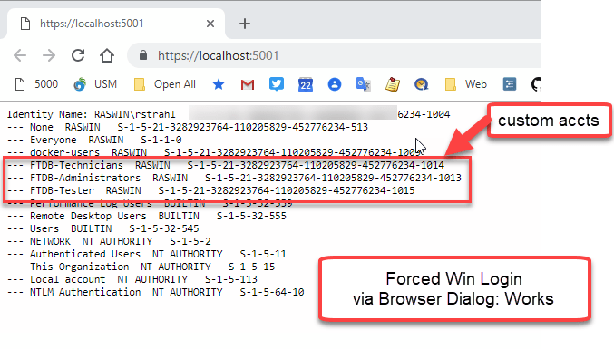
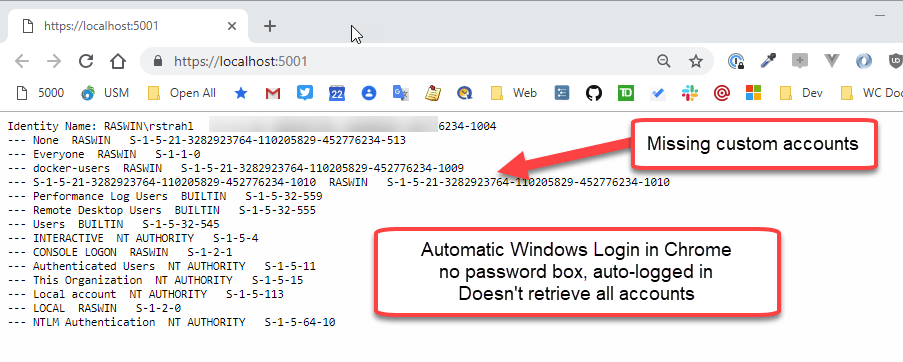

# Windows Authentication and Account Caching on Web Browser Auto-Logins


Last week I ran into a nasty issue that had me seriously stumped. I've been working on an ASP.NET Core application that uses Windows Authentication to capture the network Active Directory login and needs access the user's AD and Windows group membership. 

Seems easy enough - ASP.NET Core includes support for Windows Authentication including in Kestrel and on Windows this works as you would expect it to.

To set up Windows Authentication you need to add a Nuget package:

```xml
<PackageReference Include="Microsoft.AspNetCore.Authentication.Negotiate" Version="3.0.0" />
```

and then hook it up in `ConfigureServices()`:

```csharp
services
    .AddAuthentication(NegotiateDefaults.AuthenticationScheme)
    .AddNegotiate();
```

and in `Configure()`:

```csharp
// Enable System Authentication
app.UseAuthentication(); 
app.UseAuthorization();
```

> ##### @icon-warning Middleware Order Matters
> Make sure you hook up Windows Authentication `.UseAuthentication()` and `.UseAuthorization` **after** `.AddRouting()` but before any other middleware that uses authentication like MVC or Pages or StaticFiles. If the order is wrong, authentication won't work.

Once hooked up authentication works as you would expect it to: You can apply it via an `[Authorize]` attribute on a controller or you can simply check `context.User.Identity` for the Windows `WindowsIdentity` or `WindowsPrincipal`. You can also explicitly challenge with a `401` response. The authentication provider gives you the authentication status, user account info along with the all the Windows or Active Directory Groups the user is part of.

Simple enough.


## Auto-Logons vs Explicit Logins: Different Results?
I've been working on an application that relies on ActiveDirectory Group membership, to validate access to modules and components and since I don't actually have an AD server running on my local setup I've been using local Windows groups. The behavior of these groups vs. AD groups is not very different. So while I explicitly created a few custom groups that I can work with in this application locally.

But I ran into a perplexing snag that took me a few days to track and eventually solve with the help of a Stack Overflow question I posted (more on this below). 

Depending on how I logged into my local development Web site I was getting a different set of groups returned to me. Explicitly logging in with a browser dialog would net an accurate list of groups, but automatically getting logged in by Windows auto-login in Chromium browsers or classic Edge would only show me a truncated list.

**Explicit Login**

    
<small>**Figure 1** - An explicit login via Browser Login Dialog properly returns the new groups.</small>

**Automatically Logged in**

    
<small>**Figure 2** - Result from an automatic login is missing the the custom groups.</small>

Yikes what the heck is going on here? Two very different results **for the same exact Windows User**! Notice those custom groups I created for the application are not showing up in **Figure 2**.

> #### Testing Forced Login
> Windows by default is set up to use automatic logins. Chromium browsers (Chrome, Edgium, Brave, Vivaldi etc.) and classic Edge use this setting to automatically try and authenticate the current Windows User when an NTLM or Negotiate 401 request is received logging you in with your current Windows or AD account.
>  
> You can change this behavior and explicitly force Windows to always authenticate instead by using the `Internet Settings` from task bar, then digging into **Local Intranet -> Custom Level**. At the bottom of the list you'll find an option to specify how Windows logins are handled:
>
>   
<small>**Figure 3** - The Internet Settings dialog lets you customize how Windows gets your current Windows Login in a Browser</small>
> 
> Note that FireFox doesn't do automatic Windows logins and always forces a browser dialog for explicitly logging in.

## Watch for Cached Windows Logins
I'm going to spare you all the false starts I tried in trying to resolve this  and cut straight to the solution which was pointed out to me on [my Stack Overflow post](https://stackoverflow.com/questions/58253238/windows-authentication-in-asp-net-core-manual-login-vs-auto-intranet-login-and/58347463#58347463) by [Gabriel Luci](https://stackoverflow.com/users/1202807/gabriel-luci) quite a few days after the initial question was posted. Thanks Gabriel!

The short of it is this: I created the new accounts listed in **Figure 1**, in my currently logged in Windows Profile. In other words - New Accounts!

When using automatic login it appears that Windows is using a **cached account snapshot captured when you last logged on to Windows** for the current session.  This resulted in the missing groups shown in **Figure 2**, because the account snapshot apparently doesn't see these newly added accounts.

When Gabriel first pointed this out in the Stack Overflow post, I didn't believe it because:

* I'd been fighting this issue for nearly week by then
* I thought I had rebooted the machine

It turns out that apparently I did not reboot or log out. I did however, eventually explicitly log out of my Windows box, and logged back in, and lo and behold all the accounts are showing up now.

## Updating Groups without a Logoff?
It is possible to refresh groups by essentially reissuing the Windows Login security ticket. There's a lot of info in this article:

[How to refresh Groups Membership with User Logoff](http://woshub.com/how-to-refresh-ad-groups-membership-without-user-logoff/)

The following commands are lifted from the above article. You can check for group membership of the current user with:

```ps
whoami /groups
```

or you can use:

```ps
gpresult /r
```

This is useful to see what your actual user account is actually seeing, vs what a manual logon sees.

The latter is very slow as it scours the network for domain servers, but it provides a lot of information about the user including the group membership as well as when the auth ticket was created. When I just ran this on my machine it showed a date nearly 2 weeks ago. Yikes.

For ActiveDirectory logins you use:

```ps
klist
```

to list logins, and 

```ps
klist purge
```

to clear all logins which will force a new login next time you try to access a resource. In a Web Browser this will then force the browser dialog to pop up for explicit login which is then cached for subsequent auto-logins.

This works, but these tools are pretty obscure (I certainly never heard of them), but it's a possibility to perhaps integrate them via command line execution from within an application to refresh logins. Note all these commands don't require admin rights, so they can be run in user scope.

## Summary
This is one of those things that makes a good deal of sense once you understand what's happening, but while it's happening it seems incredibly broken. In fact, I [posted an issue on the ASP.NET Core repo](https://github.com/aspnet/AspNetCore/issues/14766) for this, because I was sure this **had to be a bug** in how groups were handled - either in Windows or inside of ASP.NET Core. I went to extreme lengths to validate this with different scenarios - running with Kestrel, running with IIS Express, running under IIS proper.

In the end this is a problem in Windows behavior with a simple solution: Log out to see your new group memberships and other updated user account info. 

This isn't ideal obviously and can easily bite you, because I suspect I'm not the only user who rarely logs out or reboots his machine these days. For me It's not uncommon to be logged in without an explicit log off for a few weeks at a time which is a long time to not refresh your account group settings.

In an application that means that if users are added to Windows or Active Directory Groups and your application depends on those new groups, you have to force users to log out and back in. This is problematic on several fronts -detectingg when that happens, and getting users to actually perform an annoying log off/log on cycle.

It's an edge case to be sure, but if you have long logged in accounts which is not uncommon these days, this issue might come to bite you too... now you know what to do :-)