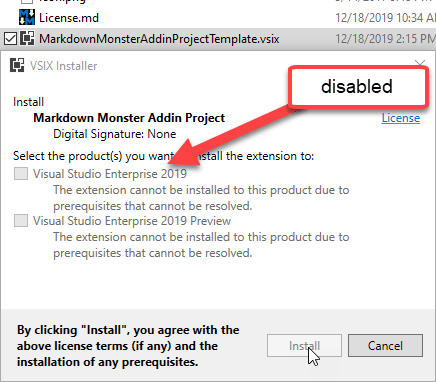
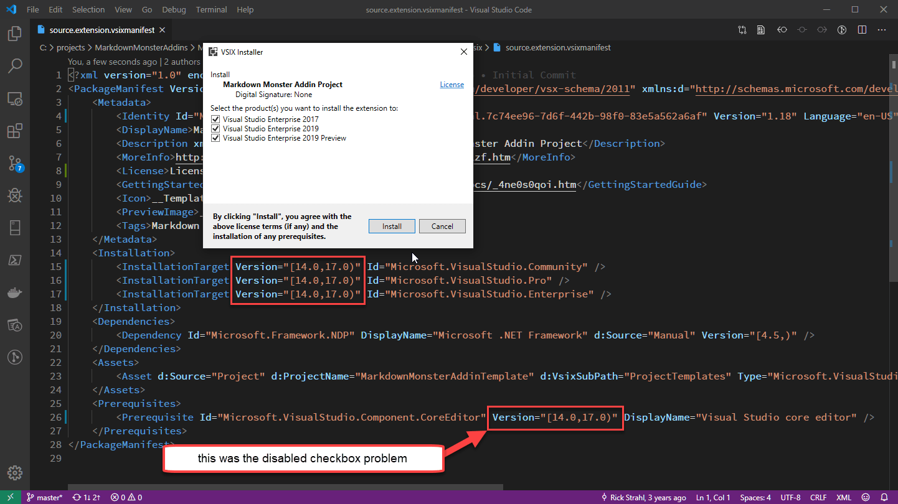
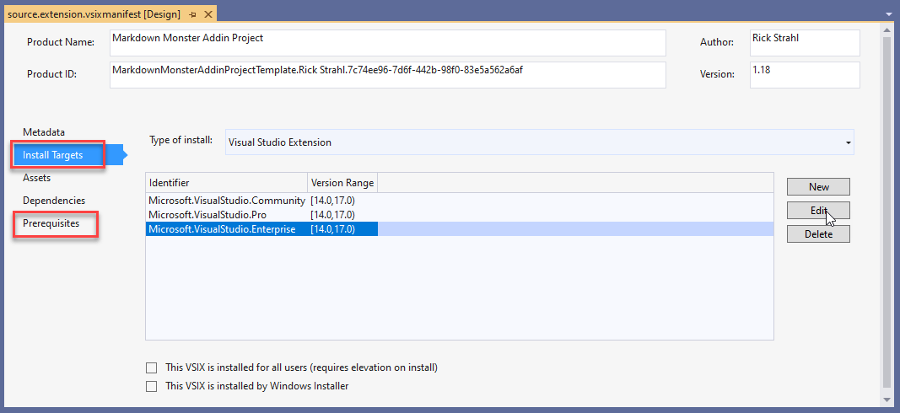

# VSIX Installer Manifest and Visual Studio Version Numbers

{style="width: 100%"}

I ran into a problem with my VSIX installer today when I tried to install my updated Visual Studio addin for the [Markdown Monster Addin Project Template](https://marketplace.visualstudio.com/items?itemName=RickStrahl.MarkdownMonsterAddinProject). This is a Visual Studio 2019 Project Template for [Markdown Monster](https://markdownmonster.west-wind.com/) that creates a ready to run addin for Markdown Monster that can then be customized to build a custom addin to integrate into a [variety of features of Markdown Monster](https://markdownmonster.west-wind.com/docs/_4ne0s0qoi.htm).

Anyway today I needed to update this template to use a new version of .NET since I recently switched Markdown Monster to require .NET 4.7.2 due to .NET Standard compatibility ([you can read about some of the why's here](https://weblog.west-wind.com/posts/2019/Feb/19/Using-NET-Standard-with-Full-Framework-NET)). In order to do this I had to update the old template which used the .NET 4.6.2 framework.

So I updated the framework version in my project template to 4.7.2 and happily recompiled my VSIX project expecting it to just work. I ran it in Debug mode and it worked so I was like "Cool - that was easy for a change.". 

But that was where the **cool** part stopped.

## No Visual Studio 2019 Installation showing
My very first attempt to try to install the compiled VSIX from disk, didn't show me Visual Studio 2019 as an installation option Instead the installer **only installed** for Visual Studio 2017. My first thought was that the addin was already installed in 2019, but when I looked in the extensions dialog - nothing; it's not installed. Huh?

Turns out, the problem was the version configuration for Visual Studio versions because - surprise surprise - Visual Studio uses some funky wanna be SemVer version scheme for its versioning that doesn't work like you'd expect SemVer to work.

You need to specify which versions of Visual Studio your addin supports. I want to support VS 2017 and VS 2019 so it seems reasonable to set the following in `source.extension.vsixmanifest`:

```xml
<Installation>
    <InstallationTarget Version="[14.0,16.0)" Id="Microsoft.VisualStudio.Community" />
    <InstallationTarget Version="[14.0,16.0)" Id="Microsoft.VisualStudio.Pro" />
    <InstallationTarget Version="[14.0,16.0)" Id="Microsoft.VisualStudio.Enterprise" />
</Installation>
```

Versions 14 and 16 refer to Visual Studio 2017 and Visual Studio 2019 respectively. This works for Visual Studio 2017 (v14), but  fails for my current Visual Studio 2019 Enterprise installation. 

Turns out the reason is that my version of Visual Studio is not 16.0 but 16.4 which is the 4th revision of 2019. The only way I could get this to work is to use `17.0` as the version number:

```xml
<Installation>
    <InstallationTarget Version="[14.0,17.0)" Id="Microsoft.VisualStudio.Community" />
    <InstallationTarget Version="[14.0,17.0)" Id="Microsoft.VisualStudio.Pro" />
    <InstallationTarget Version="[14.0,17.0)" Id="Microsoft.VisualStudio.Enterprise" />
</Installation>
```

and that worked to now at least show me Visual Studio 2019 as an installation option.

> Note Visual Studio doesn't use SemVer but some funky versioning scheme that requires that you use the next full .0 version. I tried using `16.5` and `16.9` for the upper bound and those values **did not work**. I had to use `17.0`. Thanks to [Mads' Blog Post](https://devblogs.microsoft.com/visualstudio/visual-studio-extensions-and-version-ranges-demystified/) to discover that little unobvious gem which eventually ended my version number bingo.

## Disabled Visual Studio Version Checkboxes
Ok so that gets me my Visual Studio 2019 Addin installation prompt, but... it still wasn't working correctly. I ended up with disabled checkboxes when running the installer:



This time the issue was caused by the missing core editor despendency which also needs to have a version range defined. I had updated the installation targets but didn't update the Prerequisites which caused the disabled checkboxes.

```xml
<Prerequisites>
    <Prerequisite Id="Microsoft.VisualStudio.Component.CoreEditor" Version="[14.0,17.0)" DisplayName="Visual Studio core editor" />
</Prerequisites>
```

Once I fixed this setting I finally had success:




Note that both of these settings - the Installation Targets and Prerequisites - can also be set through the Addin Project dialog:



So you can set those same values there instead of in the `source.extension.vsmanifest` file.

## Summary
Visual Studio Addins are always a pain in the ass. The documentation is terrible and VSIX installer is absolutely god-awful. Every single thing i've built as a VSIX has major problems as part of the install process, and this is just one more thing to add to the long list of UI and functionality failures of this whole process. How hard would it be instead of just disabling things to display an error message or at the very least a **more info** Web link? But no - let's let users and the developers just poke around in the dark... 

Hopefully this post helps you find the information to solve this particular if this same kind of version conflict happens to you, so you don't have to waste an hour or a few trying to randomly change things in hope that it'll fix the problem...